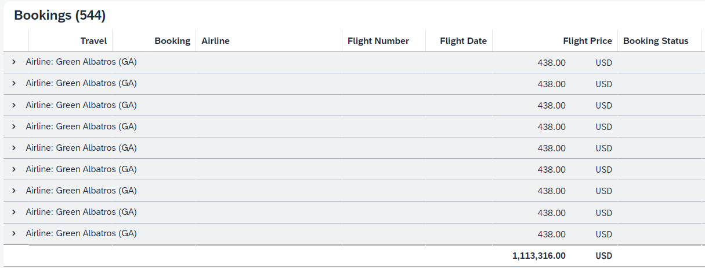

# Demo of bug issue

There are two issues that we encountered while developing an ALP with entity restrictions applied. We have made changes to the original cap-sflight package in the following files:

-   `package.json` - Added `userAttributes` to `admin` user.
-   `analytics-service.cds` - Added `@restrict` with `where` condition.

## There are two issues:

### Issue 1

We attempted to impose a restriction on a nav element, and it worked as expected for the list page. However, when using `exists` in the `where` condition for ALP, it resulted in a data dump in the terminal when attempting to load the application.

```
  @(restrict: [
    {
      grant: 'READ', to: 'authenticated-user',
      where: 'exists to_Flight.to_Connection.DestinationAirport[AirportID = $user.dest]'
    },
  ])
```

We found that querying by URL worked and displayed the correct results: `http://localhost:4004/analytics/Bookings?$select=DestAirport`

### Issue 2

To work around the previous issue, we tried checking on the flattened property `DestAirport`.

```
  @(restrict: [
    {
      grant: 'READ', to: 'authenticated-user',
      where: 'DestAirport = $user.dest'
    },
  ])
```

This approach did not crash the server like using `exists`, however it did not display the correct results. You can see the issue in the following table result image:



There should not be multiple lines for the same group.

## CDS version

-   @sap/cds: 6.7.0
-   @sap/cds-compiler: 3.8.2
-   @sap/cds-dk: 6.7.0
-   @sap/cds-dk (global): 6.7.0
-   @sap/cds-foss: 4.0.0
-   @sap/cds-mtx: 2.6.4
-   @sap/cds-mtxs: 1.7.0
-   @sap/eslint-plugin-cds: 2.6.3
-   @sap/hdi-deploy: 4.6.0
-   @sap/instance-manager: 3.5.3
-   Node.js: v16.13.2

## Run locally

### Build and Run - Node.js Backend

To build and run the Node.js backend, navigate to the root folder of your project and execute the following commands:

```
npm ci
cds watch
```

### Accessing the SAP Fiori Apps

The application for this test is the "analytics" app:

-   http://localhost:4004/travel_analytics/webapp/index.html for the [Analytical List Page](https://ui5.sap.com/#/topic/3d33684b08ca4490b26a844b6ce19b83) (ALP)

Log in with user `admin` and `admin` password.
